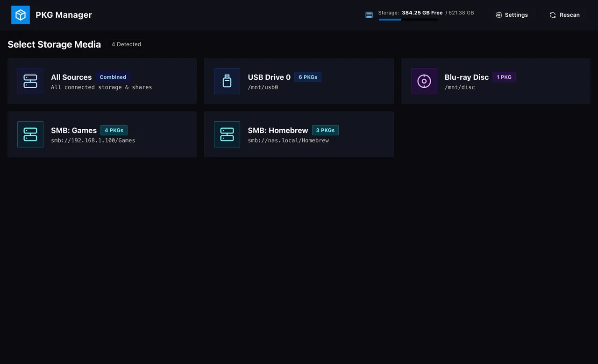
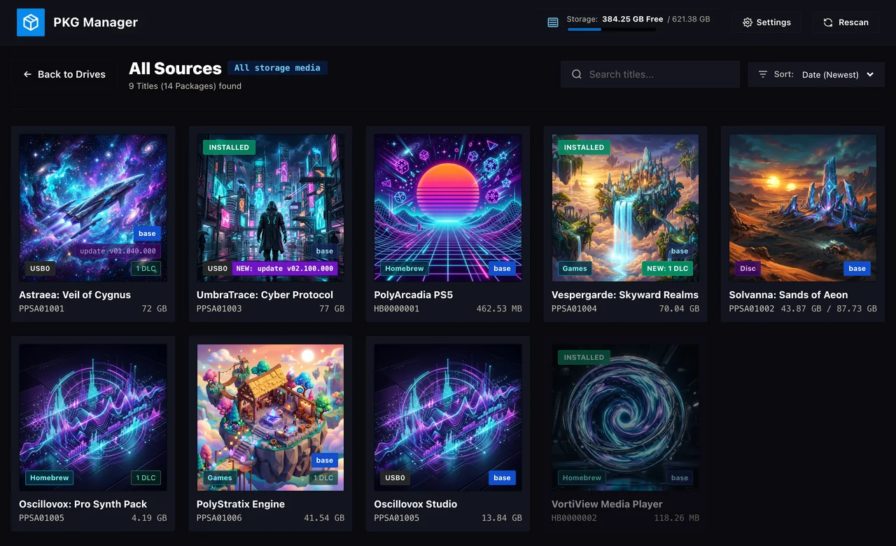
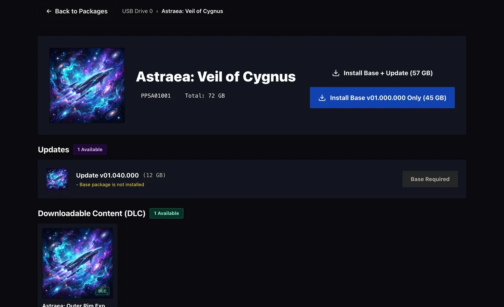
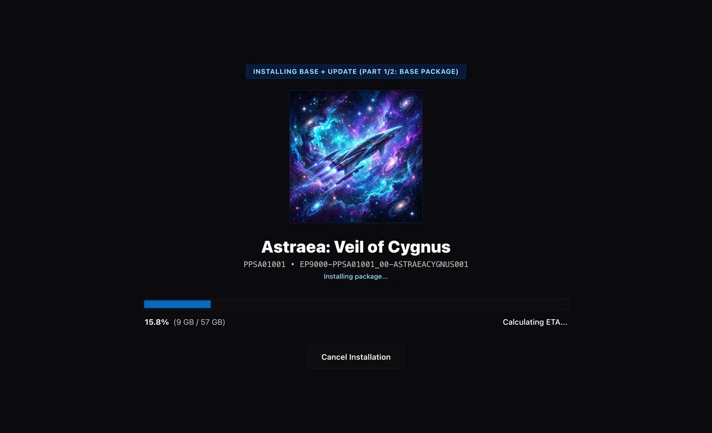
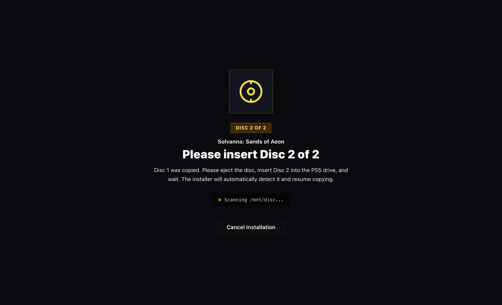
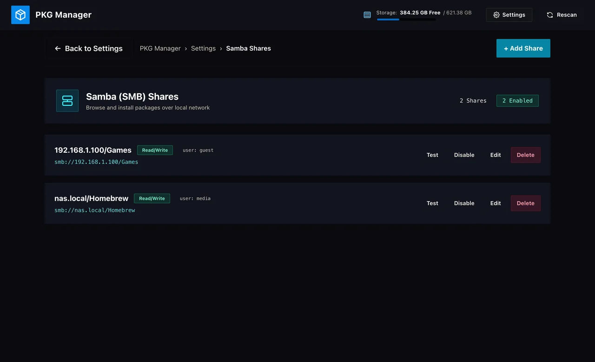

<p align="center">
  
</p>
<h1 align="center">PKG Manager X</h1>

<p align="center">A clean and intuitive package manager for PlayStation 5 and PlayStation 4. Browse and install your packages directly from USB drives or over your network (Samba/SMB or HTTP/HTTPS), with support for multi-part packages.</p>

> **PKG Manager X** is a fork of [itsPLK/ps5-pkg-manager](https://github.com/itsPLK/ps5-pkg-manager).
> It tracks upstream (`git fetch upstream && git merge upstream/main`) and adds:
>
> - **HTTP / HTTPS sources**: install straight from a web server (nginx, Apache, Caddy,
>   `python -m http.server`, NAS web shares) using byte-range streaming, with Basic auth and
>   certificate verification or pinning. See [docs/HTTP_SOURCES.md](docs/HTTP_SOURCES.md).
> - **PS4 / PS5 tags**: every package shows which console it is for (read from the package
>   itself), a PS4/PS5 filter, and a warning when a package sits in the other console's folder.
>   `PS4/` and `PS5/` folders on USB drives and discs are scanned like `pkg/`.
> - **PS4 payload** (`pkg-manager-x_*_ps4.elf`, GoldHEN): same UI and sources; PS5 packages
>   are shown but cannot be installed. **Experimental, see [docs/PS4.md](docs/PS4.md) before use.**

| | |
|:---:|:---:|
| **Select Storage Media**<br> | **Package Browser**<br> |
| **Package Details & Add-ons**<br> | **Installation Progress**<br> |
| **Multi-Part Disc Swapping**<br> | **Samba (SMB) Settings**<br> |

## Features

- **Clean Web Interface**: Displays your packages with package titles, icons, and version information.
- **USB & Network (Samba/SMB) Support**: Automatically detects packages on connected USB drives, or stream them over your local network from a PC or NAS via Samba shares.
- **Direct Install**: Install a local PKG file from another device on your network, such as a PC, directly to the console.
- **Multi-Part Packages & Disc Swapping**: Install large packages split across multiple optical discs or USB drives, with on-screen prompts when swapping discs. Ideal for physical backups!
- **No Duplicate Storage Needed**: Installs packages directly on the fly without requiring double the storage space for temporary copy files.
- **Installed Version Detection**: Checks your console to display installed application versions and prevent duplicate package installs.
- **Home Screen Shortcut**: Installs a dedicated shortcut tile to your PS5 home screen for quick and easy access.
- **Leftover Cleanup**: Detects and cleans up orphaned files and directories commonly left behind on console storage after a database rebuild.

## Installation

Download the latest versioned ELF for your console (for example, `pkg-manager-x_v1.2.4-x1_ps5.elf` or `..._ps4.elf`) from the [Releases](https://github.com/bsk193/pkg-manager-x/releases) page. Versions are `<upstream version>-x<N>` (see [DEVELOPMENT.md](DEVELOPMENT.md#versioning-pkg-manager-x)).

- **Payload Manager (Recommended)**: Use [Payload Manager](https://github.com/itsPLK/ps5-payload-manager) to launch the downloaded ELF automatically.
- **Manual ELF Loading**: You can load the downloaded ELF like any other standard ELF payload.

## Usage

### Accessing the Interface
Once running, open the interface in either of the following ways:
- Launch the **PKG Manager** shortcut tile directly from the PS5 home screen.
- Open `http://[PS5_IP]:8844` in any web browser on a phone, tablet, or PC connected to the same local network.

### Package Locations
When using a USB drive or optical disc, packages are detected in:
- The **root** directory of the drive (nested folders in root are not scanned).
- The **/pkg/** directory, where nested subdirectories are also scanned (e.g. `/pkg/homebrew/`).
- **/PS4/** and **/PS5/** folders (any letter case, also `PS4 Games`, `ps5_pkgs`, ...), scanned the same way as `/pkg/`.

### Network Shares (Samba / SMB)
You can configure SMB network shares in the app's **Settings** tab to browse and install packages stored on your PC or NAS.

### HTTP / HTTPS Servers
Add a server under **Settings → Network Sources**. Packages are found through the server's directory listing
(sub-folders included) or an `index.json` made with `tools/make_http_index.py`. The server must support
HTTP byte ranges. Details, server examples and HTTPS options: [docs/HTTP_SOURCES.md](docs/HTTP_SOURCES.md).

### Direct Install
From another device on the same network, open the PKG Manager interface and choose **Direct Install**. Select or drop a local `.pkg` file to install it directly on the console.

### Multi-Part Packages
If you want to back up large packages onto optical discs (Blu-ray, DVD) or are limited by storage media size, you can split your package into multi-part files using the included tool:

```bash
python3 tools/pkg_split.py /path/to/package.pkg -s 23G
```

Multi-part packages can be burned across multiple discs or loaded directly from a USB drive. When installing from discs, the installer will automatically detect inserted media and prompt you with on-screen notifications whenever a disc swap is needed.

## Architecture
For in-depth technical details regarding the system architecture, range streaming, and installation pipeline, see [ARCHITECTURE.md](ARCHITECTURE.md).

## Credits
PKG Manager X is based on [PKG Manager](https://github.com/itsPLK/ps5-pkg-manager) by PLK.

The following projects were used as foundations or reference for different parts of this project:
- [John Törnblom](https://github.com/john-tornblom) - [PS5 Payload SDK](https://github.com/ps5-payload-dev/sdk), [PS4 Payload SDK](https://github.com/ps4-payload-dev/sdk)
- [flatz](https://github.com/flatz) - Remote Package Installer (PS4 BGFT install flow)
- [Mbed TLS](https://github.com/Mbed-TLS/mbedtls) - HTTPS support
- [LightningMods](https://github.com/LightningMods) - [etaHEN](https://github.com/etaHEN/etaHEN)
- [earthonion](https://github.com/earthonion) - [garlic-savemgr](https://github.com/earthonion/garlic-savemgr)
- [sahlberg](https://github.com/sahlberg) - [libsmb2](https://github.com/sahlberg/libsmb2)
- Everyone contributing to the PS5 homebrew scene.

## Donations
If you'd like to support my work, please check out [DONATE.md](DONATE.md).

## Development
For build instructions, test runner details, and deployment scripts, see [DEVELOPMENT.md](DEVELOPMENT.md).
