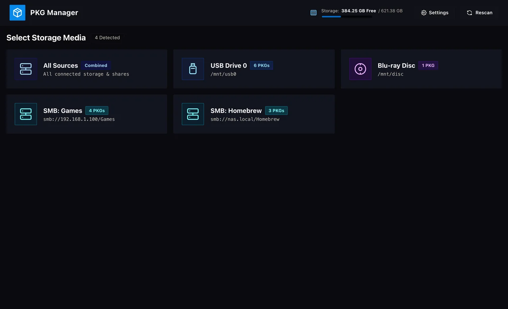
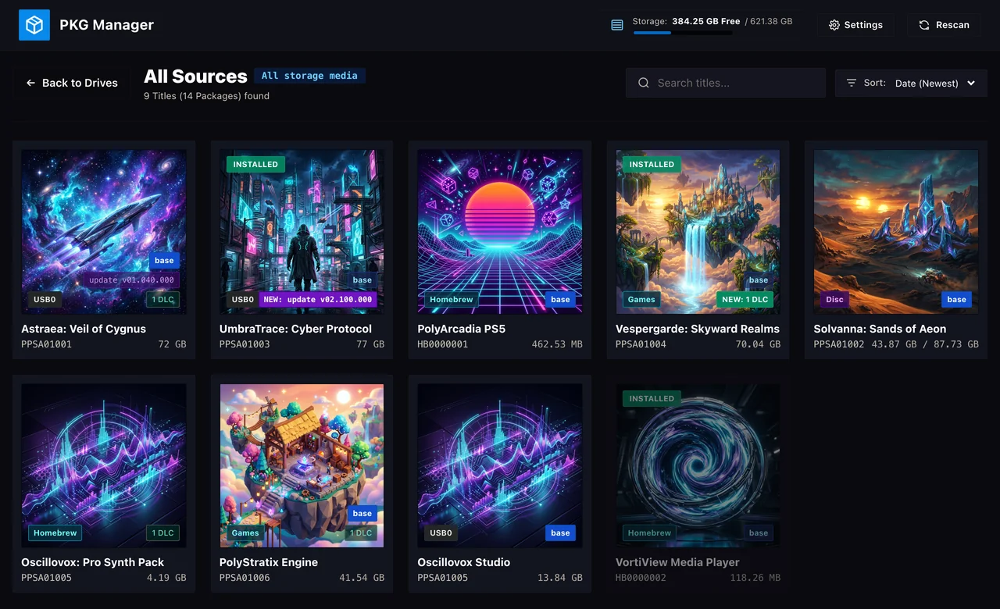
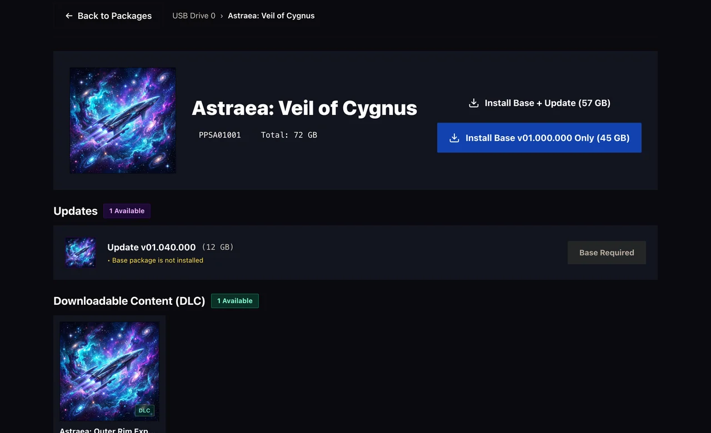
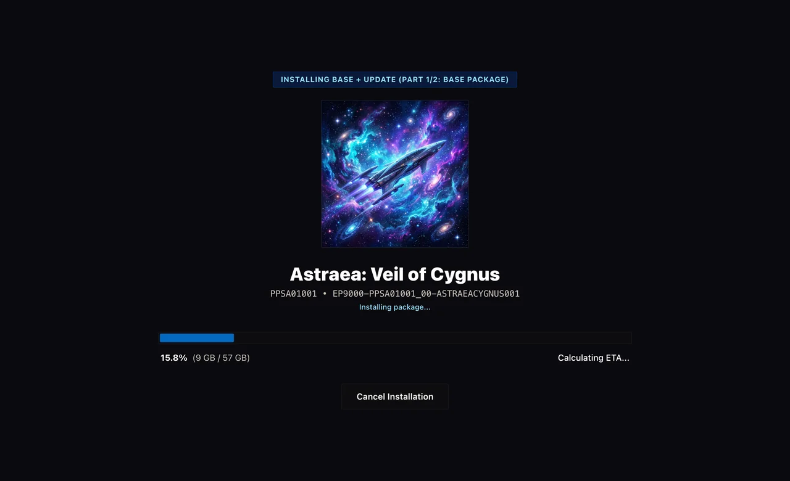
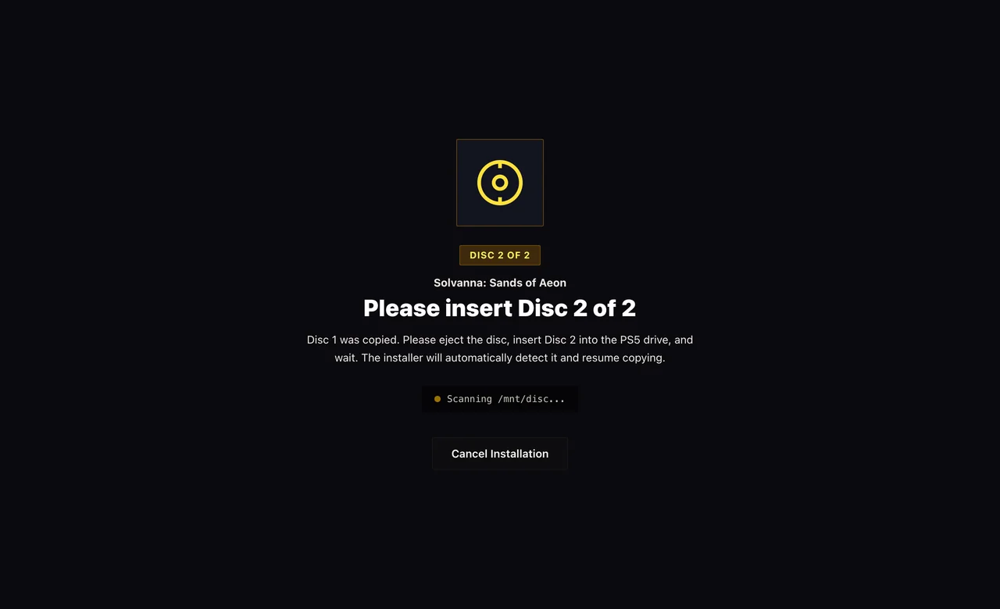
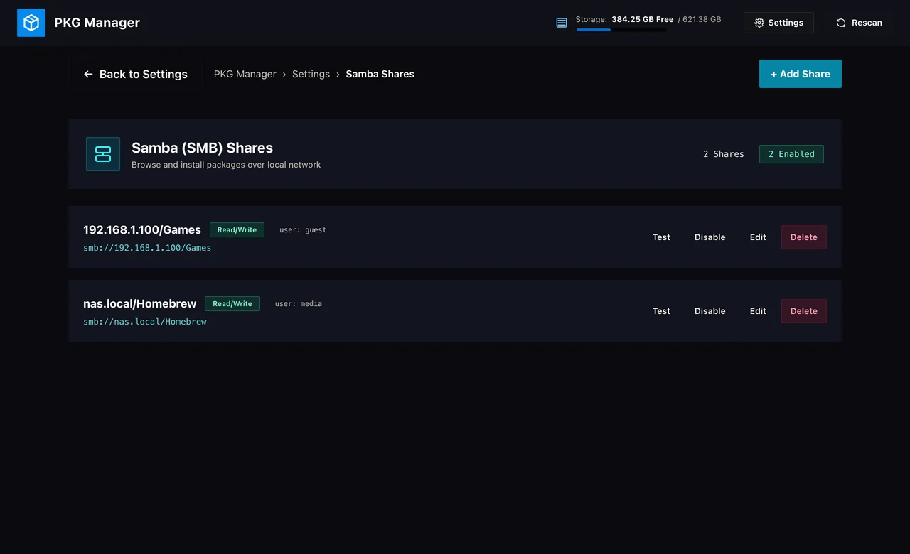

<p align="center">
  
</p>
<h1 align="center">PKG Manager X</h1>

<p align="center">A clean and intuitive package manager for PlayStation 5 and PlayStation 4. Browse and install your packages directly from USB drives or over your network (Samba/SMB or HTTP/HTTPS), with support for multi-part packages.</p>

> **PKG Manager X** is a fork of [itsPLK/ps5-pkg-manager](https://github.com/itsPLK/ps5-pkg-manager).
> It tracks upstream (`git fetch upstream && git merge upstream/main`) and adds:
>
> - **HTTP / HTTPS sources**: install straight from a web server (nginx, Apache, Caddy,
>   `python -m http.server`, NAS web shares) or a home-server gateway (`api/catalog`, local or
>   Cloudflare R2 downloads with automatic link refresh) using byte-range streaming, with Basic
>   auth and a built-in CA list. See [docs/HTTP_SOURCES.md](docs/HTTP_SOURCES.md).
> - **PS4 / PS5 tags and types**: console and type (game, DLC, update, homebrew) are read from
>   the package itself, never from folder names. Filters by console and type; packages this
>   console cannot install stay visible, greyed with the reason ("PS5 only", "PS4 homebrew
>   doesn't run on PS5"), and can be hidden. `PS4/` and `PS5/` folders on USB drives and discs
>   are scanned like `pkg/`.
> - **PS4 payload** (`pkg-manager-x_*_ps4.elf`, GoldHEN): same UI and sources; PS5 packages
>   are shown but cannot be installed. **Experimental, see [docs/PS4.md](docs/PS4.md) before use.**

| | |
|:---:|:---:|
| **Select Storage Media**<br> | **Package Browser**<br> |
| **Package Details & Add-ons**<br> | **Installation Progress**<br> |
| **Multi-Part Disc Swapping**<br> | **Samba (SMB) Settings**<br> |

## Features

- **Clean Web Interface**: Displays your packages with package titles, icons, and version information.
- **USB & Network (Samba/SMB) Support**: Automatically detects packages on connected USB drives, or stream them over your local network from a PC or NAS via Samba shares.
- **Direct Install**: Install a local PKG file from another device on your network, such as a PC, directly to the console.
- **Multi-Part Packages & Disc Swapping**: Install large packages split across multiple optical discs or USB drives, with on-screen prompts when swapping discs. Ideal for physical backups!
- **No Duplicate Storage Needed**: Installs packages directly on the fly without requiring double the storage space for temporary copy files.
- **Installed Version Detection**: Checks your console to display installed application versions and prevent duplicate package installs.
- **Home Screen Shortcut**: Installs a dedicated shortcut tile to your PS5 home screen for quick and easy access.
- **Leftover Cleanup**: Detects and cleans up orphaned files and directories commonly left behind on console storage after a database rebuild.

## Installation

Download the latest versioned ELF for your console (for example, `pkg-manager-x_v1.0.0_ps5.elf` or `..._ps4.elf`) from the [Releases](https://github.com/bsk193/pkg-manager-x/releases) page. PKG Manager X has its own version numbers; each release says which PKG Manager version it is based on (see [DEVELOPMENT.md](DEVELOPMENT.md#versioning-pkg-manager-x)).

- **PS5**: add the ELF to [Payload Manager](https://github.com/itsPLK/ps5-payload-manager) (autoload) or load it with elfldr (port 9021).
- **PS4**: send the ELF with the GoldHEN payload loader (port 9090). See [docs/PS4.md](docs/PS4.md).

## Usage

### Accessing the Interface
Once running, open the interface in either of the following ways:
- Launch the **PKG Manager** shortcut tile directly from the PS5 home screen.
- Open `http://[PS5_IP]:8844` in any web browser on a phone, tablet, or PC connected to the same local network.

### Package Locations
When using a USB drive or optical disc, packages are detected in:
- The **root** directory of the drive (nested folders in root are not scanned).
- The **/pkg/** directory, where nested subdirectories are also scanned (e.g. `/pkg/homebrew/`).
- **/PS4/** and **/PS5/** folders (any letter case, also `PS4 Games`, `ps5_pkgs`, ...), scanned the same way as `/pkg/`.

### Network Shares (Samba / SMB)
You can configure SMB network shares in **Settings → Samba** to browse and
install packages stored on your PC or NAS. Network shares are not refreshed
automatically; use the **Rescan** button to update the package catalog after
adding new files.

For Windows shares without a username or password, see the
[Windows 11 guest-sharing FAQ](#how-do-i-connect-to-a-windows-11-share-without-a-password).

### HTTP / HTTPS Servers
Add a server under **Settings → Network Sources**. Packages are found through the server's directory listing
(sub-folders included) or an `index.json` made with `tools/make_http_index.py`. The server must support
HTTP byte ranges. Details, server examples and HTTPS options: [docs/HTTP_SOURCES.md](docs/HTTP_SOURCES.md).

### Direct Install
From another device on the same network, open the PKG Manager interface and choose **Direct Install**. Select or drop a local `.pkg` file to install it directly on the console.

### Multi-Part Packages
If you want to back up large packages onto optical discs (Blu-ray, DVD) or are limited by storage media size, you can split your package into multi-part files using the included tool:

```bash
python3 tools/pkg_split.py /path/to/package.pkg -s 23G
```

Multi-part packages can be burned across multiple discs or loaded directly from a USB drive. When installing from discs, the installer will automatically detect inserted media and prompt you with on-screen notifications whenever a disc swap is needed.

## FAQ

### How do I connect to a Windows 11 share without a password?

Guest sharing allows other devices on your local network to read shared
packages without entering credentials. Configure the following on the
**Windows PC hosting the files**:

1. **Enable file sharing & turn off password protection.** Set the PC's network
   profile to **Private**. Open **Settings → Network & internet → Advanced
   network settings → Advanced sharing settings**. Under **Private networks**,
   enable **Network discovery** and **File and printer sharing**. Under **All
   networks**, turn off **Password protected sharing**. Ensure File and Printer
   Sharing is allowed through Windows Firewall for the private network.

2. **Share the folder with read access.** Right-click your package folder, open
   **Properties → Sharing → Advanced Sharing**, enable **Share this folder**,
   and name it (e.g. `PS5PKG`). In **Permissions**, grant **Everyone → Read**.
   In the folder's **Security** tab, verify that **Everyone** (or **Users**) has
   **Read & execute**, **List folder contents**, and **Read** permissions. Share
   and filesystem permissions both apply.

3. **Add the share in PKG Manager.** In **Settings → Samba**, enter the PC's IP
   address as **Server**, leave port **445**, and enter `PS5PKG` as **Share**.
   Leave **Username** and **Password** blank. Use **Test connection**, then save
   the share. If **Select share** fails, type the share name directly: Windows
   may block listing shares while allowing access to a known share.

<details>
<summary><b>Troubleshooting / If connection fails (Windows 11 24H2, Pro, or Enterprise)</b></summary>

Newer Windows 11 releases (such as 24H2) or Pro/Enterprise editions enforce SMB
signing and restrict guest logons by default. If the connection fails or
returns access denied errors, check the following:

#### 1. Enable the built-in Guest account
Open **PowerShell as Administrator** and run:

```powershell
$guest = Get-LocalUser | Where-Object { $_.SID.Value -like '*-501' }
$guest | Enable-LocalUser
$guest | Select-Object Name
```

#### 2. Permit Guest to log on over the network
On Windows editions with Local Security Policy, open `secpol.msc` and navigate
to **Local Policies → User Rights Assignment**:
* Remove **Guest** from **Deny access to this computer from the network**.
* Ensure **Access this computer from the network** includes **Guest** or a group
  that permits its access.

#### 3. Allow unsigned guest sessions and disable encryption
Windows guest sessions cannot use SMB signing or encryption. In administrator
PowerShell, run:

```powershell
# Disable signing requirement for the SMB server:
Set-SmbServerConfiguration -RequireSecuritySignature $false -Force

# Verify and disable SMB encryption if enabled:
Set-SmbServerConfiguration -EncryptData $false -Force
Set-SmbShare -Name 'PS5PKG' -EncryptData $false -Force
```

#### Common Failures

| Error | What to check |
| --- | --- |
| Account disabled / `0xC0000072` | Enable the Guest account in step 1 above. |
| Logon type not granted / `0xC000015B` | Check the network logon policies in `secpol.msc` (step 2). |
| Signing required | Disable the server signing requirement (step 3), or use a Windows account with credentials. |
| Access denied / `0xC0000022` | Check guest logon, signing/encryption requirements, and both Share and Security permission lists. |

> **Note**: Windows' **Enable insecure guest logons** (`AllowInsecureGuestAuth`)
> policy controls Windows acting as an SMB *client*. It does not enable guest
> access to shares *hosted* by that PC.

References: Microsoft's [Windows file-sharing guide](https://support.microsoft.com/en-us/windows/experience/connectivity-networking/file-sharing-over-a-network-in-windows),
[SMB signing requirements](https://learn.microsoft.com/en-us/windows-server/storage/file-server/smb-signing),
[Guest account activation](https://learn.microsoft.com/en-us/powershell/module/microsoft.powershell.localaccounts/enable-localuser),
and [network logon deny policy](https://learn.microsoft.com/en-us/previous-versions/windows/it-pro/windows-10/security/threat-protection/security-policy-settings/deny-access-to-this-computer-from-the-network).
For diagnostic commands and Windows VM test results, see
[SMB diagnostics](docs/SMB_DIAGNOSTICS.md).

</details>

## Architecture
For in-depth technical details regarding the system architecture, range streaming, and installation pipeline, see [ARCHITECTURE.md](ARCHITECTURE.md).

## Credits
PKG Manager X is based on [PKG Manager](https://github.com/itsPLK/ps5-pkg-manager) by PLK.

The following projects were used as foundations or reference for different parts of this project:
- [John Törnblom](https://github.com/john-tornblom) - [PS5 Payload SDK](https://github.com/ps5-payload-dev/sdk), [PS4 Payload SDK](https://github.com/ps4-payload-dev/sdk)
- [flatz](https://github.com/flatz) - Remote Package Installer (PS4 BGFT install flow)
- [Mbed TLS](https://github.com/Mbed-TLS/mbedtls) - HTTPS support
- [LightningMods](https://github.com/LightningMods) - [etaHEN](https://github.com/etaHEN/etaHEN)
- [earthonion](https://github.com/earthonion) - [garlic-savemgr](https://github.com/earthonion/garlic-savemgr)
- [sahlberg](https://github.com/sahlberg) - [libsmb2](https://github.com/sahlberg/libsmb2)
- Everyone contributing to the PS5 homebrew scene.

## Donations
If you'd like to support my work, please check out [DONATE.md](DONATE.md).

## Development
For build instructions, test runner details, and deployment scripts, see [DEVELOPMENT.md](DEVELOPMENT.md).
